# core-v-verif-team — Team Routing Guide

Identificativo team: **`core-v-verif-team`**
Ambito: Functional verification CV32E40P (GVSOC ISS, DPI co-sim, trace comparison, AXI formal).

Questo file integra i 46 agenti globali di `~/.claude/agents/` con la knowledge base MCP (3 livelli) e le dispatch-rules. Non duplica `CLAUDE.md` — aggiunge **solo** il "chi chiamare per cosa".

## Quick Routing per Area

### CV32E40P — ISS / GVSOC

| Area | Agente primario | Agente secondario | Note |
|------|----------------|-------------------|------|
| Esecuzione test (make test/comp) | `sim-operator` | — | Usa Monitor per DPI (>25min) |
| Trace comparison (GVSOC_TRACE) | `sim-operator` → `trace-analyzer` | `gvsoc-cv32e40p` | sim-operator lancia, trace-analyzer diagnostica |
| DPI co-simulation (ISS=GVSOC) | `sim-operator` | `gvsoc-debugger` | USE_ISS=YES obbligatorio |
| Divergenza trace (PC/register mismatch) | `trace-analyzer` | `cv32e40p-rtl-expert` | trace-analyzer diagnostica, rtl-expert conferma behavior |
| CSR behavior / write mask | `cv32e40p-rtl-expert` | `gvsoc-cv32e40p` | rtl-expert per spec, gvsoc-cv32e40p per ISS model |
| ISS bug fix (C++ GVSOC) | `gvsoc-developer` | `gvsoc-cv32e40p` | gvsoc-developer edita, gvsoc-cv32e40p valida 28 #ifdef |
| ISS crash / SIGSEGV | `gvsoc-debugger` | `gvsoc-developer` | debugger prima (root cause), developer poi (fix) |
| Nuovo test C assembly | `test-generator` | `sim-operator` | test-generator scrive, sim-operator verifica |
| Regressione completa | `gvsoc-regression-orchestrator` | `sim-operator` (batch=4) | Orchestrator gestisce Phase 0/1/2 |
| Regressione singolo (test,cfg) | `gvsoc-parallel-runner` | — | Worker leggero, nessun fix |
| Architettura GVSOC (Python targets, API) | `gvsoc-worker` | — | Domande interne GVSOC |

### AXI Verification (progetto /data/marco.paci/projects/axi)

| Area | Agente primario | Agente secondario | Note |
|------|----------------|-------------------|------|
| Nuovo modulo (vplan) | `axi-planner` | — | Crea verification plan |
| SVA generation | `axi-sva-generator` | `axi-assertionforge` | Generator per nuovo, AssertionForge per undetermined |
| SVA lint | `axi-lint-operator` | — | Haiku, post-generation SEMPRE |
| SVA review | `axi-reviewer` | `axi-sva-pattern-linter` | Opus, parallelo con lint |
| Formal proof (JasperGold) | `axi-formal-operator` | — | Batch prove, analizza risultati |
| CEX analysis | `axi-cex-analyzer` | `axi-formal-debugger` | Root cause CEX |
| SVA fix (targeted) | `axi-fix-operator` | — | Minimal edit post-CEX |
| Formal config tuning | `axi-formal-config-optimizer` | — | >20% undetermined |
| Coverage analysis | `axi-coverage-analyzer` | — | UCDB/text → gaps |
| Coverage closure | `axi-coverage-closure` | `axi-coverage-optimizer` | Generate + execute targeted sequences |
| UVM testbench gen | `axi-uvm-testbench-generator` | — | RTL + SVA → UVM TB |
| Protocol check | `axi-protocol-checker` | — | Post-TB creation |
| Regression failures | `axi-regression-analyzer` | — | Triage + root cause |
| RTL architecture | `axi-rtl-expert` | — | Signal behavior, design intent |
| Vplan management | `axi-vplan-manager` | `axi-vplan-sync-validator` | Traceability matrix |
| Requirement mapping | `axi-requirement-mapper` | — | Sign-off audit |
| Documentation | `axi-doc-generator` | `axi-doc-reviewer` | Reports, sign-off packages |
| Full project review | `axi-team-orchestrator` | — | Multi-agent coordinated review |

### Cross-Cutting

| Area | Agente primario | Agente secondario | Note |
|------|----------------|-------------------|------|
| Pianificazione multi-file | `planner` | `architect` | >3 file o >3 agenti |
| Code review Python | `python-reviewer` | `code-reviewer` | Dopo modifica .py |
| Code review C++ | `cpp-reviewer` | `code-reviewer` | Dopo modifica .cpp/.hpp |
| Code review SV/UVM | `sv-uvm-reviewer` | — | Dopo modifica .sv/.svh |
| Security review | `security-reviewer` | — | Per codice security-sensitive |
| Research HW verif | `hw-verif-researcher` | — | Paper, tecniche, tool |
| Research Claude Code | `claude-optimizer` | — | Ottimizzazione sessioni |
| Skill curation | `skill-curator` | — | Learnings → skills |
| Agent evaluation | `agent-evaluator` | — | Metriche, proposte miglioramento |

## Playbook

### PB-1: Fix GVSOC Divergence (trace mismatch)

```mermaid
gantt
    title PB-1: Fix GVSOC Divergence
    dateFormat X
    axisFormat %s

    section Phase 1 - Diagnosi
    sim-operator: run test        :sim, 0, 2
    trace-analyzer: diagnosi      :trace, after sim, 3
    cv32e40p-rtl-expert: confirm  :rtl, after sim, 3

    section Phase 2 - Fix
    gvsoc-developer: apply fix    :fix, after trace, 2
    sim-operator: rebuild GVSOC   :build, after fix, 1

    section Phase 3 - Verify
    sim-operator: re-test         :retest, after build, 2
    code-reviewer: review fix     :review, after fix, 2
```



**Sequenza:**
1. `sim-operator` → esegui test con ISS=GVSOC_TRACE, raccogli output
2. `trace-analyzer` ‖ `cv32e40p-rtl-expert` → diagnosi parallela (trace vs RTL behavior)
3. `gvsoc-developer` → applica fix C++ basato su diagnosi
4. `sim-operator` → rebuild GVSOC + re-test
5. `code-reviewer` → review fix (parallelo al re-test)
6. Se PASS → chiuso. Se FAIL → loop da step 2

**Escalation:** dopo 3 fix falliti → riportare all'utente con diagnosi completa.

### PB-2: DPI Co-Simulation Failure

```mermaid
gantt
    title PB-2: DPI Co-Sim Failure
    dateFormat X
    axisFormat %s

    section Triage
    sim-operator: run DPI test    :sim, 0, 5
    gvsoc-debugger: crash analysis:dbg, after sim, 3

    section Fix
    gvsoc-developer: fix C++/Py   :fix, after dbg, 3
    sim-operator: rebuild         :build, after fix, 1

    section Verify
    sim-operator: re-test DPI     :retest, after build, 5
    cpp-reviewer: review          :review, after fix, 3
```



**Sequenza:**
1. `sim-operator` → esegui DPI test (USE_ISS=YES ISS=GVSOC), usa Monitor per streaming
2. Se crash → `gvsoc-debugger` (root cause: DPI bridge, GVSOC engine, Python model)
3. Se mismatch → `trace-analyzer` → come PB-1
4. `gvsoc-developer` → fix
5. `sim-operator` → rebuild + re-test
6. `cpp-reviewer` → review C++ (parallelo)

### PB-3: Regressione Completa

```mermaid
gantt
    title PB-3: Full Regression
    dateFormat X
    axisFormat %s

    section Phase 0 - Compile
    sim-operator: make comp       :comp, 0, 2

    section Phase 1 - Parallel Test (batch=4)
    runner-1: test batch 1        :r1, after comp, 4
    runner-2: test batch 2        :r2, after comp, 4
    runner-3: test batch 3        :r3, after comp, 4
    runner-4: test batch 4        :r4, after comp, 4

    section Phase 2 - Fix Loop (sequential)
    trace-analyzer: diagnosi FAIL :diag, after r4, 3
    gvsoc-developer: fix          :fix, after diag, 2
    sim-operator: verify fix      :ver, after fix, 2
```



**Delegare a `gvsoc-regression-orchestrator`** — gestisce internamente tutto.

### PB-4: Nuovo Test CV32E40P

**Sequenza:**
1. `test-generator` → genera programma C bare-metal per lo scenario target
2. `sim-operator` → compila ed esegui con ISS=GVSOC_TRACE
3. `trace-analyzer` → verifica correttezza (se divergenza)
4. Se PASS → merge. Se FAIL → diagnosi e fix

### PB-5: Nuovo Modulo AXI (SVA + Formal)

```mermaid
gantt
    title PB-5: AXI Module Verification
    dateFormat X
    axisFormat %s

    section Planning
    axi-planner: vplan            :plan, 0, 2

    section Generation
    axi-sva-generator: SVA props  :sva, after plan, 3
    axi-lint-operator: lint       :lint, after sva, 1
    axi-reviewer: review          :rev, after sva, 2

    section Formal
    axi-formal-operator: JG batch :formal, after lint, 4

    section Analysis
    axi-cex-analyzer: CEX triage  :cex, after formal, 2
    axi-fix-operator: fix SVA     :fix, after cex, 1
    axi-formal-operator: re-prove :reprove, after fix, 3

    section Closure
    axi-vplan-manager: traceability:vplan, after reprove, 1
    axi-doc-generator: report     :doc, after vplan, 1
```



**Sequenza:**
1. `axi-planner` → verification plan dal modulo RTL
2. `axi-sva-generator` → genera proprietà SVA
3. `axi-lint-operator` ‖ `axi-reviewer` → lint + review paralleli
4. `axi-formal-operator` → JasperGold prove batch
5. Se CEX → `axi-cex-analyzer` → `axi-fix-operator` → re-prove
6. Se undetermined >20% → `axi-formal-config-optimizer`
7. `axi-vplan-manager` → aggiorna traceability
8. `axi-doc-generator` → report finale

### PB-6: Code Quality Audit (multi-agent parallel)

**Sequenza (parallelo):**
1. Lancia 3 agenti in parallelo:
   - `code-reviewer` → code quality findings (Python, naming, structure)
   - `cpp-reviewer` → C++ quality (memory safety, modern idioms)
   - `sv-uvm-reviewer` → SV/UVM quality (naming, patterns)
2. Raccogli risultati → merge in report unificato
3. Prioritizza → bundle per ciclo di fix

### PB-7: Nuovo CSR (gap-analysis → GVSOC → verifica)

```mermaid
gantt
    title PB-7: New CSR Implementation
    dateFormat X
    axisFormat %s

    section Phase 1 — Analysis
    cv32e40p-rtl-expert: CSR behavior  :crit, t1, 0, 3
    gvsoc-cv32e40p: ISS gap analysis   :t2, 0, 3

    section Phase 2 — Implement
    gvsoc-developer: implement CSR     :crit, t3, after t1, 3
    test-generator: create test        :t4, after t1, 2

    section Phase 3 — Verify
    sim-operator: GVSOC_TRACE test     :crit, t5, after t3, 2
    sim-operator: DPI test             :t6, after t3, 5
    code-reviewer: review fix          :t7, after t3, 2
```

**Sequenza:**
1. `cv32e40p-rtl-expert` ‖ `gvsoc-cv32e40p` → analisi parallela: RTL behavior vs ISS stato attuale
2. `gvsoc-developer` → implementa CSR nel modello GVSOC (C++)
3. `test-generator` → genera test bare-metal per il CSR (parallelo al fix)
4. `sim-operator` → test GVSOC_TRACE + DPI
5. `code-reviewer` → review fix (parallelo ai test)
6. Se PASS → aggiorna KB con `search_bugs` + `index_kb`

**Escalation:** se CSR tocca `priv.hpp` o `exception.cpp` → conferma utente obbligatoria.

## Vincoli Cross-Team

- **Python 3.12** (gvsoc_env_3_12), **Questa 2025.3**, **RISC-V GCC modded**
- **MCP-first**: SEMPRE consultare KB prima di agire (3 livelli)
- **Review post-implementazione**: OBBLIGATORIA dopo ogni modifica codice
- **Reflexion protocol**: OGNI agente emette [REFLECTION] dopo task
- **File protetti**: `priv.hpp`, `exception.cpp` → conferma utente obbligatoria

## MCP Knowledge Servers

| Server | Livello | Tool chiave | Uso |
|--------|---------|-------------|-----|
| `project-kb` | L1/L2 | `search_kb`, `get_csr`, `search_bugs`, `match_divergence` | SEMPRE primo |
| `lightrag-kb` | L3 | `graph_search`, `search_entities`, `get_entity_relations` | Query relazionali |
| `raganything-kb` | L4 | `multimodal_search`, `list_specs` | Dettagli da PDF specs |

## Stack Agentico — Versioni

Team configurato al **2026-04-12**. 46 agenti globali. 3 MCP server. MCP-first cascade. Autonomous learning loop (/evolve, /maintenance, /dashboard).
